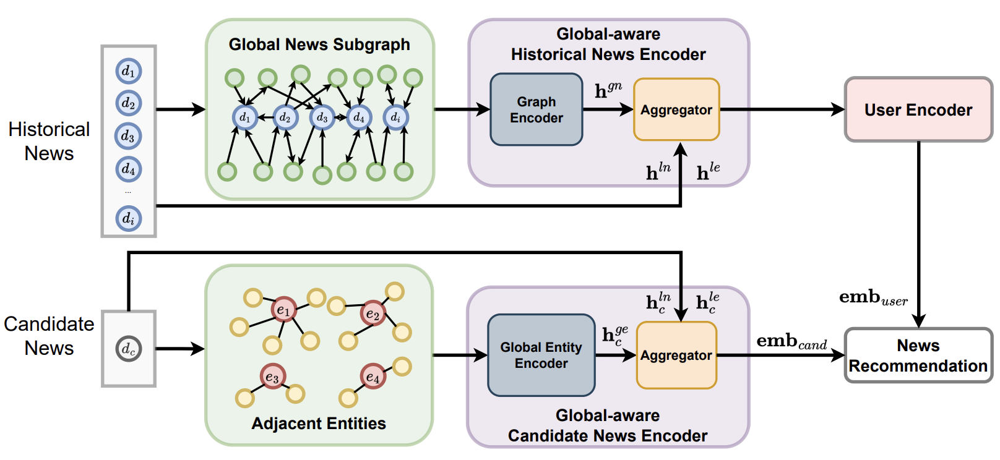

# ✨GLORY: Global Graph-Enhanced Personalized News Recommendations
Code for our paper [_Going Beyond Local: Global Graph-Enhanced Personalized News Recommendations_](https://arxiv.org/pdf/2307.06576.pdf) published at RecSys 2023. 

<p align="center">
  
  <br>
  Glory Model Illustration
</p>


### Environment
> Python 3.8.10
> pytorch 1.13.1+cu117
```shell
cd GLORY

apt install unzip python3.8-venv python3-pip
python3 -m venv venv
source venv/bin/activate
pip install -r requirements.txt
```

```shell
# dataset download
bash scripts/data_download.sh

# Run
python3 src/main.py model=GLORY dataset=MINDsmall reprocess=True
```

### Bibliography

```shell
@misc{yang2023going,
      title={Going Beyond Local: Global Graph-Enhanced Personalized News Recommendations}, 
      author={Boming Yang and Dairui Liu and Toyotaro Suzumura and Ruihai Dong and Irene Li},
      year={2023},
      publisher ={RecSys},
}
```


